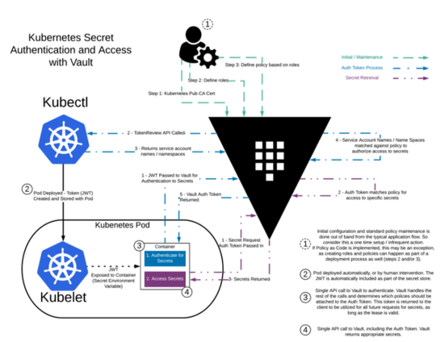

# Bellow is introduced steps to spin up the Vault platform ready to serve traffic. 

## Quick overview of the vault integration



This is 2 repos which have consul and vault helm charts required.

Vault-helm:  https://github.com/hashicorp/vault-helm 

Consul-helm: https://github.com/hashicorp/consul-helm


## Clone those 2 repos to your local (fro the reference).

```
git clone https://github.com/hashicorp/vault-helm.git

https://github.com/hashicorp/consul-k8s/tree/main/charts/consul
```

## Create separete namespace where you will have the space for vault resources.

```
k create ns vault
```

## Install consul as backend for vault using bellow values.yaml configuration file from consul-helm repo location to the vault server k8s cluster (tools).


## Create the values.yaml for consul helm chart.
```
cat helm-consul-values.yml

global:
  datacenter: vault-kubernetes-tutorial

client:
  enabled: true

server:
  replicas: 1
  bootstrapExpect: 1
  disruptionBudget:
    maxUnavailable: 0
```

## Apply the consul-helm chart with existed values.yaml

```
helm repo add hashicorp https://helm.releases.hashicorp.com
helm repo update
helm install consul hashicorp/consul --values helm-consul-values.yaml -n vault

```


## Get all the pods within the default namespace (verify all running fine).

```
kubectl get pods

NAME                     READY   STATUS    RESTARTS   AGE
consul-consul-6jcfj      1/1     Running   0          2m54s
consul-consul-server-0   1/1     Running   0          2m54s

```


## Install the Vault Helm chart.


### Inside values.yaml change bellow to use HA mode and consul as backend storage.

```
# Run Vault in "HA" mode. There are no storage requirements unless audit log
  # persistence is required.  In HA mode Vault will configure itself to use Consul
  # for its storage backend.  The default configuration provided will work the Consul
  # Helm project by default.  It is possible to manually configure Vault to use a
  # different HA backend.
  ha:
    enabled: false
    replicas: 3
```

```
helm upgrade --install vault vault-helm/ --values vault-helm/values.yaml -n vault 
```


```
$ kubectl get pods
NAME                                    READY   STATUS    RESTARTS   AGE
consul-consul-server-0                  1/1     Running   0          5m36s
consul-consul-sxpbj                     1/1     Running   0          5m36s
vault-0                                 0/1     Running   0          35s
vault-1                                 0/1     Running   0          34s
vault-2                                 0/1     Running   0          33s
vault-agent-injector-5945fb98b5-wpgx2   1/1     Running   0          36s
```

```
The vault-0, vault-1, vault-2, and vault-agent-injector pods are deployed. The Vault servers report that they are Running but they are not ready (0/1). That is because Vault in each pod is executes a status check defined in a readinessProbe.


```

## Retrieve the status of Vault on the vault-0 pod.

```
kubectl exec vault-0 -- vault status
Key                Value
---                -----
Seal Type          shamir
Initialized        false
Sealed             true
Total Shares       0
Threshold          0
Unseal Progress    0/0
Unseal Nonce       n/a
Version            n/a
HA Enabled         false
command terminated with exit code 2

```
```
The status command reports that Vault is not initialized and that it is sealed.
```

## Try to access it via UI.

```
kubectl port-forward vault-0 8200:8200

http://localhost:8200/ui
```


## Initialize Vault with one key share and one key threshold.


```
kubectl exec vault-0 -n vault -- vault operator init -key-shares=1 -key-threshold=1 -format=json > cluster-keys.json
```

The operator init command generates a master key that it disassembles into key shares -key-shares=1 and then sets the number of key shares required to unseal Vault -key-threshold=1. These key shares are written to the output as unseal keys in JSON format -format=json. Here the output is redirected to a file named cluster-keys.json.


## Display the unseal key found in cluster-keys.json.

```
cat cluster-keys.json | jq -r ".unseal_keys_b64[]" 
```


```
Insecure operation: Do not run an unsealed Vault in production with a single key share and a single key threshold. This approach is only used here to simplify the unsealing process for this demonstration.
```


## Create a variable named VAULT_UNSEAL_KEY to capture the Vault unseal key.

```
VAULT_UNSEAL_KEY=$(cat cluster-keys.json | jq -r ".unseal_keys_b64[]")
```


```
After initialization, Vault is configured to know where and how to access the storage, but does not know how to decrypt any of it. Unsealing is the process of constructing the master key necessary to read the decryption key to decrypt the data, allowing access to the Vault.
```

## Unseal Vault running on the vault-0 pod.


```
kubectl exec vault-0 -n vault -- vault operator unseal $VAULT_UNSEAL_KEY
kubectl exec vault-1 -n vault -- vault operator unseal $VAULT_UNSEAL_KEY
kubectl exec vault-2 -n vault -- vault operator unseal $VAULT_UNSEAL_KEY
```


### Should be printed something like.
```
Key                    Value
---                    -----
Seal Type              shamir
Initialized            true
Sealed                 false
Total Shares           1
Threshold              1
Version                1.4.2
Cluster Name           vault-cluster-40bde7f6
Cluster ID             7e0355e2-ee66-4d9e-f4eb-42ef453b857d
HA Enabled             true
HA Cluster             n/a
HA Mode                standby
Active Node Address    <none>
```

## First, start an interactive shell session on the vault-0 pod.


```
kubectl exec --stdin=true --tty=true vault-0 -- /bin/sh
```

## Get root token from the file.
```
cat cluster-keys.json | jq -r ".root_token"
```

## Create your first secret

```
vault secrets enable -path=secret kv-v2
vault kv put secret/webapp/config username="static-user" password="static-password"
vault kv get secret/webapp/config
exit
```


## Configure kubernetes authentication (in case you are running vault localy with aplycation on same cluster)

```
vault auth enable kubernetes

```

Vault accepts this service token from any client within the Kubernetes cluster. During authentication, Vault verifies that the service account token is valid by querying a configured Kubernetes endpoint.

Configure the Kubernetes authentication method to use the location of the Kubernetes API, the service account token, its certificate, and the name of Kubernetes' service account issuer (required with Kubernetes 1.21+)


```
vault write auth/kubernetes/config \
        kubernetes_host="https://$KUBERNETES_PORT_443_TCP_ADDR:443" \
        token_reviewer_jwt="$(cat /var/run/secrets/kubernetes.io/serviceaccount/token)" \
        kubernetes_ca_cert=@/var/run/secrets/kubernetes.io/serviceaccount/ca.crt \
        issuer="https://kubernetes.default.svc.cluster.local"
```


The token_reviewer_jwt and kubernetes_ca_cert are mounted to the container by Kubernetes when it is created. The environment variable KUBERNETES_PORT_443_TCP_ADDR is defined and references the internal network address of the Kubernetes host.

## Create policy

For a client to access the secret data defined, at secret/webapp/config, requires that the read capability be granted for the path secret/data/webapp/config. This is an example of a policy. A policy defines a set of capabilities.

Write out the policy named webapp that enables the read capability for secrets at path secret/data/webapp/config.

```
vault policy write webapp - <<EOF
path "secret/data/webapp/config" {
  capabilities = ["read"]
}
EOF
```


## Create Vault role.

To apply this policy requires the authentication engine to define a role. A role binds policies and environment parameters together to create a login for the web application.

Create a Kubernetes authentication role, named webapp, that connects the Kubernetes service account name and webapp policy.


```
vault write auth/kubernetes/role/webapp \
        bound_service_account_names=vault \
        bound_service_account_namespaces=default \
        policies=webapp \
        ttl=24h
```

The role connects the Kubernetes service account, vault, and namespace, default, with the Vault policy, webapp. The tokens returned after authentication are valid for 24 hours.

Lastly, exit the vault-0 pod.


## Launch a webapp test application


Create manifest

```
apiVersion: apps/v1
kind: Deployment
metadata:
  name: webapp
  namespace: vault
  labels:
    app: webapp
spec:
  replicas: 1
  selector:
    matchLabels:
      app: webapp
  template:
    metadata:
      labels:
        app: webapp
    spec:
      serviceAccountName: vault
      containers:
        - name: app
          image: burtlo/exampleapp-ruby:k8s
          imagePullPolicy: Always
          env:
            - name: VAULT_ADDR
              value: 'http://vault:8200'
            - name: JWT_PATH
              value: '/var/run/secrets/kubernetes.io/serviceaccount/token'
            - name: SERVICE_PORT
              value: '8080'

```


The web application deployment defines a list of environment variables.

JWT_PATH sets the path of the JSON web token (JWT) issued by Kubernetes. This token is used by the web application to authenticate with Vault.
VAULT_ADDR sets the address of the Vault service. The Helm chart defined a Kubernetes service named vault that forwards requests to its endpoints (i.e. The pods named vault-0, vault-1, and vault-2).
SERVICE_PORT sets the port that the service listens for incoming HTTP requests.
Deploy the webapp in Kubernetes by applying the file deployment-01-webapp.yml.


## Refference to official documentation

https://learn.hashicorp.com/tutorials/vault/kubernetes-minikube?in=vault/kubernetes


